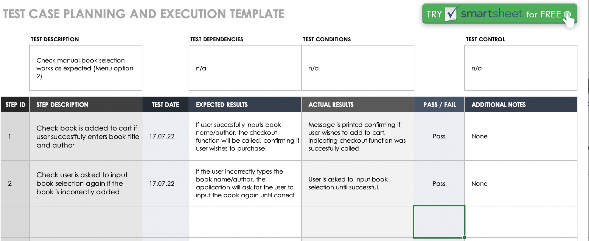

# T1A3 Terminal Application Assignment - Jordan Attfield

### Outline
My application idea is an app called 'Date with a Book" that allows users to take a quiz and based on their outcome of the quiz, a book will be selected for them to purchase. Users can add books to their shopping cart, manually select other books and also purchase add-ons.

Here is a flowchart depicting the features of the app:

### Github Link
https://github.com/JordanAttfield/T1A3-Terminal-App

### Style Guide
My code follows the PEP 8 Python styling guide throughout (Python Enhancement Proposals 2022).

### Features
**Feature 1: Quiz**

The quiz features 3 questions that determine the user's genre preference. A score is tallied and based on the score, the user will be directed to a particular genre. A book is then randomly selected from that genre's catalogue and presented to the user for purchase.

I tried to incorporate multiple Python elements within this feature. The quiz uses OOP to create a Question class and then iterates through the list of questions, also using if/else statements to keep a running count of the score based on the answers. Functions are then used to determine the genre preference depending on the score.

**Feature 2: Random Book Selector**

Upon completion of the quiz, a score will be generated which will then determine the users genre preference. There are 3 genre options:

Romance (if score is between 0-4)
Popular Fiction (if score is between 5-7)
Thriller (if score is between 8-9)

A function then uses the Random module to randomly select a book from the book catalogue. This catalogue is a dictionary which contains nested lists split into the 3 genres, with each genre belonging to a key.

**Feature 3: Manually Add Books**

The user can manually add on books by selecting this option from the menu. All books from the dictionary are then displayed. If the user wishes to purchase a book, they can enter their book, and the input is checked against the dictionary, and if it matches the book is added to their cart.

**Feature 4: Checkout Cart**

Once a book has been randomly selected for the user, the user can confirm if they wish to purchase and if so, the book is added to the checkout cart. Users can then manually add other books or add-ons to their cart and may check their cart at any time.

**Feature 5: Add ons**

I used OOP to create an Addons class which has a variety of additional non-book items the user can add to their cart. Each Addon object consists of the product name, description and price. These items are displayed to the user, and then asks the user to input the product they wish to purchase. This input is then checked against the list of objects and added to cart.

### Screenshots

### Implementation Plan

I used a Trello board to plan the implementation of my application. I started by creating a 'Feature' label and created separate cards for each feature. This helped me to prioritise the features and break the tasks down into smaller segments. In addition to the main feature cards, I also have a label for research - I knew I needed to do more research on Bash scripting, error testing and Python modules to progress in the assignment, so I added these as tasks too.

## Error Testing
The following screenshots show the manual error tests that were performed.

## Installation Instructions & Hardware/Software Requirements

Please follow the below steps to run Date with A Book:

- Open your command line and navigate to a directory you wish to run the program from.
- Copy the following link into your command line
    $ git clone https://github.com/JordanAttfield/T1A3-Terminal-App
- Once the repository has finished cloning, please enter the following into your command line:
    $ ./run_app.sh
- Once the application is successfully running, users may choose from the displayed menu options. Selecting Option 1 allows user to take a quiz to select a book. Users may also view the entire book catalogue by selecting menu option 2. Add ons can be chosen from menu option 3.

Please note the following modules are required to be installed to run the application:
- colorama: to install this module, please type the following into your command line:
    $ pip install colorama

There are no system or hardware requirements for this application.

### References

Python Enhancement Proposals 2022, PEP 8 style guide for python, viewed 14 July 2022, https://peps.python.org/pep-0008/#introduction

